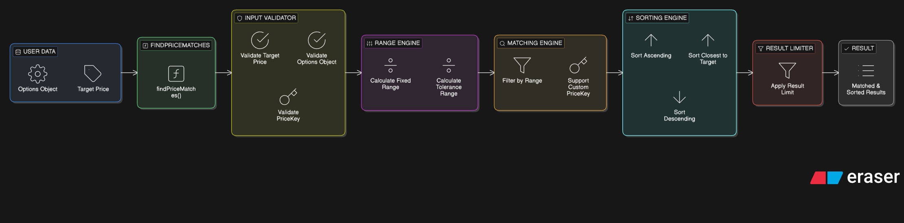

# price-scout

> Smart price range search, filtering, and sorting for real estate, e-commerce, and listing-based applications.

[](https://www.npmjs.com/package/price-scout)
[](https://opensource.org/licenses/MIT)

---

## Overview

`price-scout` is a lightweight, zero-dependency JavaScript utility for intelligent price matching and filtering.

Originally built 8 months ago and recently improved with enhanced filtering logic, sorting precision, and TypeScript optimizations.

Ideal for:
- Real Estate Platforms
- E-commerce Search
- Marketplace Listings
- Any price-based dataset

---

## Internal Architecture



The package follows a modular internal flow:

1. Input Validation
2. Range Calculation (Tolerance / Fixed / Min-Max)
3. Matching Engine
4. Sorting Engine
5. Result Limiting

This separation ensures:
- Clean logic
- High performance
- Easy extensibility
- Predictable results

---

## Features

- Exact & Fuzzy Matching (tolerance-based)
- Explicit `min` / `max` filtering
- Fixed range override support
- Sort by `closest`, `asc`, or `desc`
- Custom price key support
- Result limiting
- Zero dependencies
- Full TypeScript definitions

---

## Installation

```bash
npm install price-scout
```

---

## Usage

Basic Target Search
```javascript
const { findPriceMatches } = require('price-scout');

const properties = [
  { id: 1, price: 100000 },
  { id: 2, price: 150000 },
  { id: 3, price: 200000 },
];

const result = findPriceMatches(properties, 180000, {
  tolerancePercent: 0.20
});

console.log(result.matches);
```

Range Search (Min/Max)
```javascript
const result = findPriceMatches(properties, null, {
  min: 120000,
  max: 180000,
  sort: 'desc'
});
```

## Options

| Option	| Type	| Default	| Description	|
| --- | --- | --- | --- |
tolerancePercent	| number	| 0.2	| +/- percentage tolerance
fixedRange	| number	| null	| Fixed +/- amount (overrides percent)
min	| number	| null	| Absolute minimum
max	| number	| null	| Absolute maximum
sort	| string	| 'closest'	| closest / asc / desc
limit	| number	| 10	| Maximum results
priceKey	| string	| 'price'	| Custom object key

## Why price-scout?
- No external dependencies
- Works in Node.js & browser
- Predictable matching logic
- Designed for performance
- Production-ready utility logic

## License
MIT

